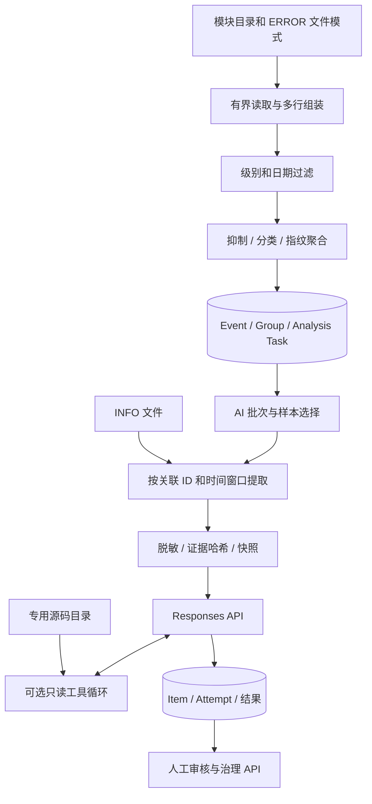

# badfisher-ai-log 设计文档

版本：0.1.0-SNAPSHOT / 2026-09-28。本文描述当前代码，并在末尾单独列出尚未实现或未验收的目标。[使用与部署](USAGE.md)提供可执行操作，[开发文档](DEVELOPMENT.md)说明验证方法。

## 1. 产品定位与技术边界

项目是先部署、再使用的日志分析平台。数据库保存异常事实、任务进度、证据与人工治理；应用解析文件并提供 API。AI 是平台内的分析能力，独立 Agent 安装包后置。没有业务前端也能通过 API 完成模块配置、解析、分析、查询与治理。

| 项目 | 当前选择 |
| --- | --- |
| Java | JDK 21；编译 release=21，Enforcer 限制 21 |
| 应用 | Spring Boot 4.1.1、Spring MVC、Jakarta Validation |
| 构建 | Maven 多模块；公开依赖，无私有 parent/repository |
| 数据访问 | MyBatis-Plus 3.5.17、MySQL、Flyway |
| JSON | Web 使用 Boot 的 Jackson 3；证据、已有业务序列化和 Responses 客户端显式使用 Jackson 2 |
| AI | JDK HttpClient 直接调用 Responses；普通结果严格校验，工具分析支持结构化输出 |
| 身份 | 配置文件账号、BCrypt、HTTP Basic、固定人员 id |
| 文档 | springdoc OpenAPI 3、Markdown |
| 默认运行依赖 | MySQL；本地日志目录，无 Redis/外部调度依赖 |

Jackson 2/3 暂时并存是明确边界，不混用 ObjectMapper 类型；后续统一 Jackson 3 必须保持证据快照及哈希契约。版本精确值以 POM 为准。Boot 4 的适配背景可见[官方发行说明](https://github.com/spring-projects/spring-boot/wiki/Spring-Boot-4.1-Release-Notes)。

## 2. 模块和主流程

| 模块 | 责任 |
| --- | --- |
| ai-log-common | 通用基础能力 |
| ai-log-domain | 日志、聚合、规则、任务等模型与端口 |
| ai-log-parser | 日志头识别、多行组装、异常结构、脱敏 |
| ai-log-analysis | 确定性分类、归一化、聚合、AI 证据及哈希 |
| ai-log-ingestion | 有界流式文件读取、gzip、SSH 同步边界 |
| ai-log-application | 文件解析编排、任务调度、INFO 选择、报告/交付应用服务 |
| ai-log-datasource | 可选 Loki 查询适配 |
| ai-log-persistence | Entity、Mapper、SQL、短事务和领取/续租实现 |
| ai-log-bootstrap | Spring 装配、配置、HTTP API、认证、OpenAI/源码/外部适配 |



规则确定分类事实；AI 给出分析意见，不直接发布规则、改变原始 ERROR 次数或替代人工完成状态。INFO 只补充解释证据，不增加异常计数。

## 3. 日志输入契约

### 3.1 文件选择

本地模式由 `badfisher.sync.enabled=false` 启用。模块 `remoteDirectory` 是服务端可读绝对路径；仅管理员能够配置。本地原始日志必须位于 `badfisher.sync.allowed-log-roots` 中；空列表拒绝读取。模块配置写入和 ERROR/INFO 实际读取均校验绝对路径与真实路径，操作系统权限仍须最小化。

ERROR 默认 `*error*.log`、`*error*.log.*`；INFO 默认 `*info*.log`、`*info*.log.*`。glob 支持 `{date}`、`{compactDate}`、`{prefix}` 占位符，不支持跨目录通配。目录枚举最多 10000 项，单次候选至多 100 个；普通文件与同名 gzip 去重，优先普通文件；拒绝文件符号链接并检查真实路径。模式可同时指向同一个混合日志文件，内容级别负责最终区分。

文件应已停止写入；只解析业务时区中已结束的日期。成功记录的幂等身份包含环境、系统、模块、日期、规范文件路径和指纹版本；同日不同轮转文件不会互相跳过。当前不是 tail 服务，同一路径同日期追加内容不会自动增量重读；避免对仍在写入的日志建立成功任务。

### 3.2 日志头

`CommonLogHeaderParser` 支持常见时间戳开头的 Spring Boot / Logback 行，以及兼容的带前缀文本、JSONL。时间可带毫秒、逗号或点分隔、ISO 偏移；缺省偏移按 `badfisher.timezone`。FATAL 归一为 ERROR。

```text
2026-01-01 10:00:00.123 [main] ERROR com.example.Service - traceId=demo failure
java.lang.IllegalStateException: synthetic failure
    at com.example.Service.run(Service.java:42)
```

```json
{"@timestamp":"2026-01-01T10:00:00Z","level":"ERROR","logger_name":"com.example.Service","thread_name":"main","traceId":"demo","message":"synthetic failure"}
```

JSONL 是一行一个对象。支持的平铺别名：

| 字段 | 别名 |
| --- | --- |
| 时间 | @timestamp、timestamp、time |
| 级别 | level、log.level、severity |
| 线程 | thread_name、thread、threadName |
| 类 | logger_name、logger、loggerClass |
| 关联 | trace_id、traceId、消息中的 traceId/TID/requestId |
| 消息 | message |

`log.level` 是平铺键，不意味着任意嵌套 ECS 结构都支持。不承诺任意 JSON、数字时间戳或未知日志格式都能正确解析。

自定义格式设置 `badfisher.log-pattern`，Java 正则必须包含命名组 timestamp、level、message，可包含 thread、logger、traceId、method。例如：

```yaml
badfisher:
  log-pattern: '^(?<timestamp>\d{4}-\d{2}-\d{2} \d{2}:\d{2}:\d{2})\|(?<level>[A-Z]+)\|(?<message>.*)$'
```

开始解析前用合成日志验证正则。不能识别的新日志头可能被当作上一条的续行；无法识别的时间不应被解释为正确业务时间。

### 3.3 事件边界与 ERROR

`StreamingLogEventReader` 固定缓冲读取；每个物理行默认保留 65536 字节，每个事件默认保留 65536 字符。超长内容被截断并保留标记，继续寻找下一个日志头；不会将整文件加载到内存。普通文件保存字节/行位置，gzip 使用行号定位。Cause、Suppressed、多行堆栈由组装与异常解析处理。

ERROR 文件中的 INFO/WARN 等显式级别不算 ERROR；缺级别降级路径沿用事件过滤器，需要通过样例测试评估。时间可识别时，仅接受请求日期内事件。抑制规则先排除明确无需治理的事件；分类规则按优先级确定类型，再归一化和聚合。文件级计数区分接受、抑制、持久化及无有效身份丢弃，避免把原始行数当成异常次数。

### 3.4 INFO 上下文

INFO 不建立独立全量数据表。AI 选出 ERROR 样本后，读取同模块候选 INFO 文件；匹配条件为同 traceId/TID 或同 requestId，并在样本时间前后窗口内。不同种类的 ID 不交叉匹配；没有 ID 不用线程名、时间接近或模型猜测代替。

默认每份证据最多 20 条、8192 字符、20 个文件、总计 64 MiB 解压后扫描量，窗口前后 120 秒。按日期、文件排序、文件内部行顺序确定性选择，不宣称是全局最近的 N 条。跨午夜读取相邻日期模式，跨文件共享扫描预算；gzip 解压量和被丢弃的超长行也计入预算。

状态包括 DISABLED、NO_CORRELATION、MODULE_UNAVAILABLE、FILES_UNAVAILABLE、NO_MATCH、MATCHED、FILE_LIMIT_REACHED、LIMIT_REACHED、READ_FAILED。可选 INFO 失败不虚构内容；保留已经取得的有限上下文并显式标注状态。只有选中的片段进入脱敏后的 AI 证据快照；统计和治理始终基于 ERROR。

## 4. 数据模型与事务

字段、默认值、索引的权威定义是 `db/migration/V1__initial_schema.sql`；`sql/schema.sql` 是保持相同内容的审查副本，有自动化一致性校验。基线无业务 INSERT、DROP、TRUNCATE，不带真实账号和规则。

| 表（统一前缀 tb_ai_log_） | 用途 |
| --- | --- |
| module_config | 环境/系统/模块、日志目录及可选代码配置 |
| sync_task、sync_module_task、file_record | 可选远程同步的父任务、模块任务及文件记录 |
| analysis_task | 文件解析身份、状态与对账计数 |
| error_event | 发生事实、样本、位置、分类、次数和时间 |
| issue_group | 稳定聚合身份 |
| issue_group_governance | 审核、处理状态、负责人、认领人和版本 |
| file_cleanup | 应用管理副本的清理状态 |
| classify_rule、suppress_rule | 确定性分类和抑制规则 |
| ai_task | AI 批次、路由及统计 |
| ai_task_item | 单个 Group 分析、证据快照、租约、最终结果 |
| ai_call_attempt | 一次分析尝试的用量、结果、耗时和错误 |
| management_operation | 显式重跑的幂等请求及操作进度 |
| author_alias | 可选源码作者线索映射 |
| ai_daily_report | 可选日报交付状态 |

原始发生事实、永久聚合身份、人工治理和 AI 结果分开存储。新 Event 不覆盖已有人工状态，不自动重开 COMPLETED 问题。发生次数从 Event 聚合，Group 行数不能替代发生次数。

解析领取、批次持久化、成功/失败和 AI 创建通过仓储事务执行；HTTP 不纳入长数据库事务。AI 首次 prepare 锁定成功解析任务，检查同 provider/model/runNo=1 再插入，避免同任务并发创建两个初始批次。数据库唯一索引是最终并发约束。

## 5. AI 协议与状态机

### 5.1 接入

每个启用的 provider 独立配置 base-url、api-key、模型白名单、连接/请求超时、最大尝试数和退避。`OpenAiResponsesClient` 发送 `POST {base-url}/responses`，不自动跟随重定向；请求带 Bearer、随机客户端请求标识、model、max_output_tokens、stream=false、store=false。协议依据[Responses API](https://platform.openai.com/docs/api-reference/responses)。

普通 Provider 将脱敏证据放在 JSON envelope 中，指定 JSON 输出；严格校验字段、枚举、长度、置信度和建议修复天数。拒绝、截断、无内容和无效 JSON 不作为成功。根因缺失时降级为待确认，而非伪造确定根因。429、5xx、网络失败归类为相应错误；请求错误与无效结果不被隐藏成正常答案。上游错误正文不直接记录，避免回显密钥或源码。

客户端没有业务级隐藏重试。持久化 Item 状态机决定下一次尝试，HTTP 超时不等于供应商没有计费或没有处理，不能声称外部调用 exactly-once。

### 5.2 批次、分析与尝试

- AI Task：PENDING/PREPARING/WAITING/RUNNING 及完成状态，限定本批候选。
- Item：WAITING/RUNNING/SUCCESS/FAILED；保存 nextRetryTime、尝试上限、claimToken、leaseOwner、leaseUntil。
- Attempt：RUNNING/SUCCESS/FAILED；调用标识、请求哈希、响应摘要、用量、耗时和错误。

领取、开始尝试、续租和终态更新校验 token，过期执行者不能覆盖新执行者。失败保留记录；显式重跑使用 management_operation，不重解析文件，也不清空已有成功结果。终态语义以 Item/Attempt 及批次计数字段共同判断，不能只看到批次 SUCCESS 就忽略失败项。

默认一个批次最多选择 200 个 Group，每页 50 个 Item，样本最多 3 个；AI 线程池默认 5 个工作线程、50 队列长度、180 秒租约。显式 Executor 和拒绝策略负责可观察失败及领取归还；不把阻塞 HTTP 放进共享 commonPool。

`evidenceHash` 使用 ev-v3，包含 INFO 内容及提取状态，证据先脱敏再哈希/保存/外发。配置版本、promptVersion、sanitizerVersion 和模型参数共同约束结果复用。脱敏是规则能力，不能保证识别任意业务敏感字段；新增输入格式时需要增补测试。

### 5.3 源码工具

Function Calling 支持 resolve_log_site、read_method、read_source、search_code；限定专用仓库目录、文件类型/大小、行数、结果字符数、命中数和总工具次数。模型不能指定 shell、编辑文件或提交代码。工具调用结果按 call_id 返回，累计多轮 token；工具额度耗尽后仅有一次收尾请求。

当前源码读取的是工作目录，不是自动冻结的 commit 快照。默认关闭，开启必须同时使用 promptVersion `ai-issue-v5-tools`。完整不可变源码绑定、工具证据引用的可重放性仍需后续完善。

## 6. API 与治理

当前同步接口用 ApiResponse 包装成功响应：code=200、message、data；业务校验失败通常为 HTTP 400。认证返回 401、授权返回 403；框架级 JSON/服务器错误不保证相同 envelope。未来状态冲突专用 409 属于演进目标，当前不虚构统一错误码契约。

| 入口 | 当前行为 |
| --- | --- |
| POST /api/pipeline/parse | 同步有界文件批次，返回成功/失败文件数 |
| POST /api/pipeline/ai/prepare | 创建或返回同解析任务的首次 AI 批次 |
| POST /api/pipeline/ai/dispatch | 调度当前可运行 AI 队列，等待本轮处理完成 |
| GET /api/pipeline/tasks、/ai/tasks | 最近任务，游标分页 |
| GET /api/pipeline/ai/tasks/{id}/items | 单批次结果与证据 |
| GET /api/pipeline/ai/items/{id}/attempts | 尝试记录与用量 |
| /api/management/module-configs | 模块配置增改查、启停、删除 |
| /api/management/classify-rules、suppress-rules | 规则管理 |
| /api/management/issue-groups | 查询、单项审核、指派、认领、解决、验收、重开 |
| /api/management/personal-workbench | 个人问题、汇总、详情与事件 |
| /api/management/dashboard | 概览、模块趋势与统计 |
| /api/management/ai-reruns | Group/Task 显式重跑及进度查询 |
| /api/log-sync | 可选同步与原任务受控重试 |
| /api/analysis/query-loki-logs | 可选 Loki 查询；不等同于持久化导入 |

Pipeline 查询通过 application 服务和领域仓储端口返回固定 DTO，分页 SQL 与首次 AI prepare 的行锁位于 persistence Mapper XML。首次 prepare 的锁、检查、插入由同一持久化事务覆盖。

操作子路径、请求体必填字段和默认值以生成的 OpenAPI 为准。管理写操作的 lockVersion 来自详情；不能自行填固定值绕过并发校验。审核按单个问题执行并提交理由；指派决定负责人，认领是个人动作，二者不等价。PENDING → PROCESSING → RESOLVED → COMPLETED 表示处理过程；忽略、撤销认领与重开按服务端权限和状态限制执行。

账号集合来自部署配置，没有对外用户注册 API。规则与解析触发只能由管理员执行；GroupPermissionPolicy 再校验治理操作者。默认不开放任意目录读取或无认证日志上传。

## 7. 实施边界与后续验收

| 能力 | 当前状态 / 后续要求 |
| --- | --- |
| JDK21、多模块公开依赖、本地 ERROR/INFO、HTTP 基础链路 | 已有实现与自动化测试；最终执行结果见交付说明 |
| 直接 Responses 请求与状态解析 | 本地 HTTP 合同测试；真实账号仍需联调 |
| MySQL 初始化与完整 AI 入库链路 | 已提供 Flyway 和显式集成测试；真实 MySQL 验收待运行 |
| Docker Compose | 已提供模板，当前环境未运行容器 |
| 源码只读工具 | 实现保留，专用目录方式；固定 commit 快照尚未实现 |
| SSH/Git、Loki、OSS、通知、日报 | 可选适配保留；目标环境逐项联调，不能仅凭编译宣布交付成功 |
| 报告 | 有 Markdown 渲染与可选外部交付；本地存储和受保护下载入口尚未补齐 |
| 通用异步提交与操作进度 | 当前 parse/dispatch 同步；持久化通用异步命令属于后续工作 |
| 自动调度 | 默认 API 手动触发；XXL 执行器未默认装配 |
| 目录根白名单 | 已实现部署级 allowed-log-roots，空列表拒绝读取；写配置与读取时双重校验 |
| 开源仓库与许可证 | GitHub / Gitee 公开仓库及 Apache-2.0 LICENSE、NOTICE 已完成 |
| 正式发行 | 当前为 0.1.0-SNAPSHOT；正式发行版与完整环境验收待完成 |

设计目标仍是完成从接入、分析到人工治理的可独立部署平台。以上未完成项不应被解释为已通过验收。独立 Agent、前端、多租户、向量库和自动代码修复均不属于当前实现。
